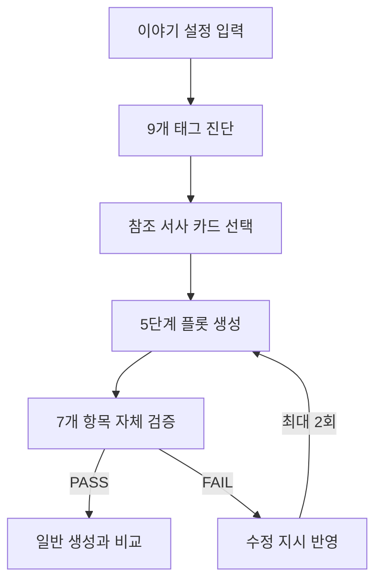

# StoryLens

> 웹소설 설정을 분석해 이야기가 산으로 가지 않도록 지켜주는 AI 창작 가드레일

[서비스 체험](https://storylens-mq5yauurya-du.a.run.app/) · [시연 영상](https://youtu.be/KAc22VodRUM) · [기획 및 개발 기록](https://vigorous-top-f64.notion.site/Story-Lens-36658d83d5f680acbde9ce5644504f37?source=copy_link)

StoryLens는 웹소설 설정을 입력하면 이야기 속 구조적 특징을 진단하고, 그 설정을 지키는 5단계 플롯을 만들어 주는 AI 창작 도구입니다.

Java와 Spring AI를 공부하면서 생성형 AI를 프로젝트에 어떻게 연결할 수 있을지 실험해 보고 싶어 만들었습니다. 단순히 이야기를 한 번 생성하는 데서 끝내지 않고, 생성 결과가 처음 설정에서 벗어나지는 않았는지 AI가 다시 검사하도록 구성했습니다.


## 만들게 된 이유

생성형 AI는 짧은 문장을 자연스럽게 만드는 데는 능숙하지만, 이야기가 길어지면 처음에 정한 목표나 설정을 놓칠 때가 있습니다.

예를 들어 회귀한 주인공만 알고 있어야 할 전생의 사건을 다른 인물이 당연히 알고 있거나, 복수를 목표로 시작한 이야기가 중간부터 전혀 다른 방향으로 흘러갈 수 있습니다. 이런 문제를 프롬프트 한 번으로 해결하기보다, 이야기의 구조를 먼저 진단하고 생성 결과를 다시 검증하는 흐름을 만들어 보고자 했습니다.

## 주요 기능

### 1. 웹소설 트로프 진단

입력한 설정을 아래 9개 태그로 분석합니다. 단순 키워드 일치가 아니라 입력문에서 판단 근거가 된 문장도 함께 보여 줍니다.

- 후회/재도전
- 복수/응징
- 신분위장/정체성은닉
- 낯선세계 적응
- 정보우위/반전
- 사회적 지위 역전
- 영웅서사/시련과 희생
- 메타인지/이중시선
- 정체성 모호성

### 2. 참조 서사 카드 선택

프로젝트에는 12개의 서사 카드 데이터가 있습니다. 이 가운데 실제 사용 대상으로 표시된 카드 중 입력 설정과 구조가 가까운 1~2개를 선택합니다.

카드는 『크리스마스 캐럴』, 『몬테크리스토 백작』, 『이상한 나라의 앨리스』 같은 퍼블릭 도메인 작품의 구조를 정리한 데이터입니다. 원작의 인물명이나 사건을 그대로 가져오지 않고, 상실·정보 획득·목표 달성 방식 같은 추상적인 구조만 참고하도록 제한했습니다.

### 3. 5단계 플롯 생성

진단 결과를 다음 5단계에 배치해 이야기의 뼈대를 만듭니다.

1. 상실
2. 회귀·각성
3. 목표 설정
4. 실행
5. 응징·도달

핵심 목표, 반드시 일어나야 할 사건, 계속 유지되어야 할 조건, 인물의 사고방식은 고정합니다. 대신 장면 묘사, 대사, 소품과 세부 행동은 매번 새롭게 만들 수 있도록 자유 영역으로 남겨 두었습니다.

### 4. 생성 결과 자체 검증

완성된 플롯을 바로 보여 주지 않고 아래 7개 항목으로 다시 검사합니다.

1. 핵심 목표가 유지되는가
2. 필수 사건이 실제로 나타나는가
3. 사건의 인과관계가 자연스러운가
4. 지속 조건이 장면 안에서 유지되는가
5. 새 사건이 핵심 흐름을 방해하지 않는가
6. 인물의 톤과 시점이 유지되는가
7. 각 장면에 긴장이나 다음 행동의 계기가 있는가

검증에 실패하면 구체적인 수정 지시를 다음 생성에 전달하고, 최대 2회까지 자동으로 다시 생성합니다.

### 5. 일반 생성 결과와 비교

같은 입력으로 만든 일반 AI 생성 결과와 StoryLens 결과를 나란히 보여 줍니다. 구조 가드레일과 자체 검증이 있을 때 이야기가 어떻게 달라지는지 확인할 수 있으며, StoryLens 결과는 텍스트 파일로 내려받을 수 있습니다.

## 동작 흐름



각 작업을 하나의 AI 모델에 모두 맡기지 않고, 작업 성격에 따라 모델을 나누어 사용했습니다.

| 단계 | 역할 | 사용 모델 |
| --- | --- | --- |
| 태그 진단 | 9개 태그와 입력 근거 추출 | `gpt-5-nano` |
| 카드 선택 | 후보 카드의 구조 비교 | `gpt-5-mini` |
| 플롯 생성 | 5단계 장면 생성 | `gpt-5.6-luna` |
| 자체 검증 | 7개 체크리스트 판정 | `gpt-5.6-terra` |

## 기술 스택

| 구분 | 사용 기술 |
| --- | --- |
| Backend | Java 21, Spring Boot 4.1, Spring AI 2.0, Maven |
| Frontend | React 19, Vite 8, Tailwind CSS 4, Framer Motion |
| Data | JSON 기반 태그 및 서사 카드 |
| AI | OpenAI API |
| Deploy | Docker, Google Cloud Run |

별도의 회원 기능이나 데이터베이스는 사용하지 않았습니다. 태그와 서사 카드 데이터는 정적 JSON 파일로 관리합니다.

## 프로젝트 구조

```text
storylens/
├── frontend/                         # React 화면
│   └── src/
├── src/main/java/com/storylens/
│   ├── tag/                          # 태그 진단
│   ├── cardselection/                # 참조 서사 카드 선택
│   ├── plot/                         # 일반 생성 및 5단계 플롯 생성
│   ├── verify/                       # 자체 검증
│   └── logging/                      # 파이프라인 실행 로그
├── src/main/resources/
│   ├── data/                         # tags.json, narrative_cards.json
│   └── prompts/                      # 단계별 프롬프트
├── src/test/                         # 서비스 단위 테스트
├── Dockerfile
└── pom.xml
```

## 로컬 실행 방법

### 준비물

- Java 21
- Maven 3.9 이상
- Node.js 22 이상
- OpenAI API 키

### 1. 저장소 복제

```bash
git clone https://github.com/daily-flat-factory/storylens.git
cd storylens
```

### 2. API 키 설정

WSL, Linux, macOS:

```bash
export LLM_API_KEY="발급받은 API 키"
```

Windows PowerShell:

```powershell
$env:LLM_API_KEY="발급받은 API 키"
```

API 키는 코드나 커밋에 직접 넣지 않고 환경 변수로만 설정해 주세요.

### 3. 백엔드 실행

```bash
mvn spring-boot:run
```

백엔드는 `http://localhost:8080`에서 실행됩니다.

### 4. 프론트엔드 실행

새 터미널을 열고 아래 명령어를 실행합니다.

```bash
cd frontend
npm ci
npm run dev
```

브라우저에서 `http://localhost:5173`으로 접속합니다. 개발 서버는 `/api` 요청을 `http://localhost:8080`으로 전달합니다.

### Docker로 실행

프론트엔드와 백엔드를 한 번에 빌드하려면 Docker를 사용할 수 있습니다.

```bash
docker build -t storylens .
docker run --rm -p 8080:8080 -e LLM_API_KEY="발급받은 API 키" storylens
```

빌드가 끝나면 `http://localhost:8080`으로 접속합니다.

## API

모든 요청은 다음과 같은 JSON 형식으로 보냅니다.

```json
{
  "input": "주인공과 상황, 이루려는 목표를 포함한 이야기 설정"
}
```

| Method | Endpoint | 설명 |
| --- | --- | --- |
| `POST` | `/api/diagnose` | 9개 태그 진단 |
| `POST` | `/api/generate` | 진단부터 자체 검증까지 전체 과정 실행 |
| `POST` | `/api/generate-naive` | 비교용 일반 생성 실행 |

## 현재 범위와 한계

- 공모전 시연을 목표로 만든 MVP라서 회원가입과 결과 저장 기능은 없습니다.
- 태그 9개와 서사 카드 12개를 정적 데이터로 사용합니다.
- AI 응답에 따라 결과가 달라질 수 있으며, 전체 분석에는 보통 2분 안팎이 걸립니다.
- API 호출 비용이 발생하므로 개인 API 키와 사용량을 확인해야 합니다.
- 현재는 플롯 생성까지 구현했으며, 앞으로는 만들어진 플롯을 바탕으로 설정과 흐름을 유지하는 장편 웹소설 생성까지 확장해 보고 싶습니다.
- 또한 웹소설 설정을 대상으로 시작했지만, 같은 구조를 다른 문서 생성과 검증에도 적용할 수 있도록 리팩토링 해보려고 합니다.

## 만들면서 배운 점

처음에는 좋은 프롬프트 하나를 만들면 문제가 해결될 것이라고 생각했습니다. 하지만 실제로 구현해 보니 입력 분석, 참조 선택, 생성, 검증을 작은 단계로 나누고 각 단계의 출력 형식을 코드에서 확인하는 편이 훨씬 안정적이었습니다.

또한 AI의 자유를 모두 막으면 결과가 반복되고, 너무 풀어 주면 설정을 잊는 문제가 생겼습니다. 그래서 반드시 지켜야 할 조건과 자유롭게 바꿀 수 있는 표현을 나누는 방식으로 균형을 잡았습니다.

아직 개선할 점이 많은 프로젝트지만, Spring 기반 백엔드에서 여러 AI 작업을 연결하고 생성 결과를 다시 검증하는 전체 흐름을 직접 구현해 본 데 의미가 있습니다.

## 관련 자료

- [StoryLens 서비스](https://storylens-mq5yauurya-du.a.run.app/)
- [시연 영상](https://youtu.be/KAc22VodRUM)
- [기획서와 개발 로그](https://vigorous-top-f64.notion.site/Story-Lens-36658d83d5f680acbde9ce5644504f37?source=copy_link)
